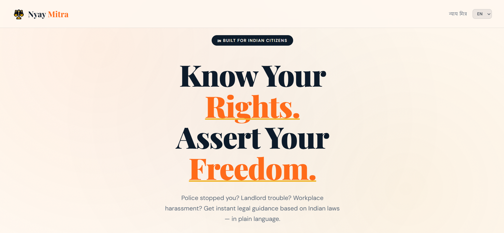
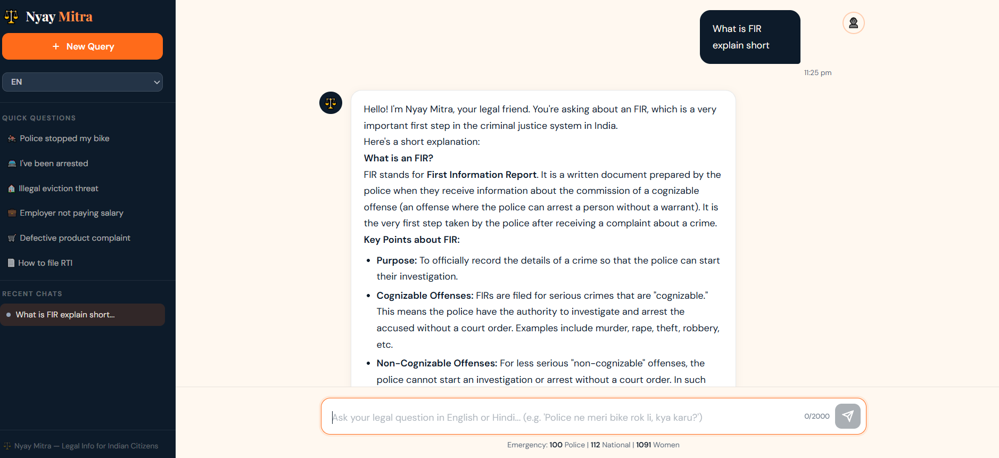

# ⚖️ Nyay Mitra — Your Legal Friend



🚀 **Nyay Mitra** is an AI-powered legal guidance chatbot built for Indian citizens. It provides instant, plain-language answers to legal questions — from police encounters to landlord disputes — grounded in real Indian laws.

🔗 **Live Demo:** *(add your deployed link here)*

---

## 📌 Features

- 💬 **AI-powered legal chat** — Ask any legal question in plain language
- 🇮🇳 **India-specific** — Answers grounded in IPC, CrPC, RTI, MVA, CPA, and more
- 🌐 **Multilingual support** — Available in Hindi and English (i18n-ready)
- ⚡ **No sign-up required** — Start chatting instantly, free of cost
- 🔒 **Privacy-first** — No account, no data stored
- 📱 **Responsive design** — Works seamlessly on mobile and desktop

---

## 🧠 How It Works

1. 🔗 **Ask Your Question**
   The user types a legal question — e.g., *"Can police arrest me without a warrant?"*

2. ⚡ **AI Processes the Query**
   The app sends the query to the AI backend with a system prompt grounded in Indian law.

3. 📚 **Legal Reasoning**
   The model references relevant acts and constitutional articles to frame an accurate answer.

4. 📊 **Plain-Language Answer**
   The user receives a clear, jargon-free response with applicable laws cited.

---

## 🧩 Use Cases

| Scenario | Legal Domain |
|----------|-------------|
| Police stopped you on the road | CrPC, Fundamental Rights |
| Landlord refusing to return deposit | Rent Control Acts |
| Workplace harassment | POSH Act, Labour Laws |
| Received a defective product | Consumer Protection Act, 2019 |
| Want to file an RTI application | RTI Act, 2005 |
| Traffic challan dispute | Motor Vehicles Act, 1988 |
| Family property disputes | Hindu Succession Act |

---

## 🏛️ Legal Coverage

| Code | Full Name |
|------|-----------|
| IPC | Indian Penal Code |
| CrPC | Code of Criminal Procedure |
| Art. 21 | Right to Life & Liberty (Constitution) |
| MVA | Motor Vehicles Act, 1988 |
| RTI | Right to Information Act, 2005 |
| CPA | Consumer Protection Act, 2019 |

---

## 🧠 Tech Stack

| Layer | Technology |
|-------|-----------|
| Frontend | HTML5, CSS3 |
| Styling | CSS Custom Properties, Responsive Design |
| Logic | JavaScript (Vanilla JS) |
| Fonts | Playfair Display, DM Sans (Google Fonts) |
| i18n | Custom JS i18n module (`i18n.js`) |
| AI Backend | Claude / OpenAI API *(configure as needed)* |
| Deployment | Netlify / Vercel / GitHub Pages |

---

## 📸 Preview

**

---

## ⚙️ Setup Instructions

1. Clone the repository:
```bash
git clone https://github.com/<your-username>/nyay-mitra.git
```

2. Navigate to the project folder:
```bash
cd nyay-mitra
```

3. Create a `.env` file for backend configuration:
```bash
API_KEY=YOUR_AI_API_KEY
CORS_ORIGINS=https://your-deployed-site.netlify.app,http://localhost:5500
REQUEST_TIMEOUT_MS=5000
```

4. Start the backend server (if applicable):
```bash
node server.js
```

5. Open the frontend:
- Simply open `index.html` in your browser, or
- Use Live Server (VS Code extension) for hot reload

---

## 🌐 Multilingual Support

Nyay Mitra uses a custom `i18n.js` module. Language strings are defined per-locale and applied via `data-i18n` attributes on HTML elements.

To add a new language:
1. Add a new locale object in `js/i18n.js`
2. Add the language option to the `buildLangSwitcher()` function
3. All `data-i18n` keys will be auto-translated on language switch

---

## ⚠️ Important Notes

- This app provides **legal information**, not legal advice
- Do **NOT** expose your API key publicly — use environment variables
- For court matters, always consult a licensed advocate
- Emergency numbers are displayed in the footer for user safety

---

## 🚀 Future Improvements

- 🤖 **Smarter legal reasoning** with retrieval-augmented generation (RAG) over Indian law corpus
- 📝 **Document generator** — auto-draft RTI applications, legal notices, and complaint letters
- 📊 **Case tracker** — follow up on filed complaints and RTI requests
- 🗣️ **Voice input** — speak your legal question in Hindi or regional languages
- 🌍 **Regional language support** — Bengali, Tamil, Telugu, Kannada, Marathi
- 🔐 **Lawyer connect** — optional referral to licensed advocates for serious matters
- 📱 **Mobile app** — React Native or PWA version

---

## 👨‍💻 Authors

**Your Name**
- GitHub: [@Rahul](https://github.com/real-rahul1)

**Collaborator Name** 
- GitHub: [@Mrinal](https://github.com/Mrinalray)

---

## ⭐ Support

If you find this project useful:
- ⭐ Star the repo
- 🍴 Fork it and build on it
- 📢 Share with friends who need legal help

---

## 📜 Disclaimer & License

> ⚖️ **Nyay Mitra** provides legal **information**, not legal **advice**. For court matters or serious legal issues, consult a licensed advocate.

> 🆘 Emergency Numbers: **100** (Police) | **112** (National Emergency) | **1091** (Women Helpline)

This project is intended for educational and public-interest purposes.
